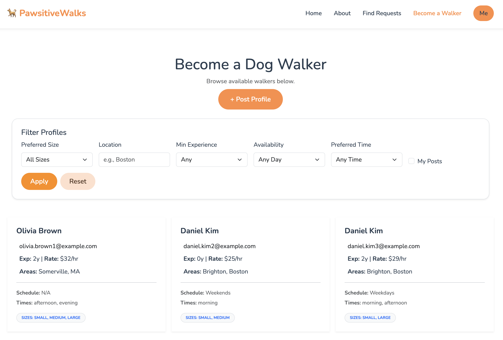

# PawsitiveWalks

## Members

- Jiahui Zhou
- Yi-Peng Chiang

## Class Link

- [CS5610-2026-Spring](https://johnguerra.co/classes/webDevelopment_online_spring_2026/)
- This is Project2 for this class

## Website Link

- [PawsitiveWalks](https://dog-walker-project.onrender.com)

## Project Link

- [GitHub Repo](https://github.com/Jiahui-Zhou98/Dog-walker-project.git)

## Project Description

A zero-fee community platform connecting dog owners with trusted dog walkers. Unlike commercial services, PawsitiveWalks serves as a simple bridge — not a middleman — displaying contact information directly for free negotiation. Dog owners post walking requests; walkers create profiles showcasing their experience and availability. The platform also enables group walks, social meetups, and welcomes dog lovers without pets to gain hands-on experience.

## Project Objective

- Build a zero-fee community platform where dog owners and walkers can connect directly without platform commissions.
- Support two full workflows: posting dog walking requests and publishing dog walker profiles.
- Provide account-based access control so users can manage only their own posts.
- Make discovery practical with filtering, pagination, and location/time preference matching.
- Keep deployment production-ready using MongoDB Atlas + Render with environment-based secrets and guarded seed scripts.

## Core Features

- Authentication: register, login, logout, and current-user session check (`/api/auth/me`).
- Requests workflow: create, read, update, delete, filter, paginate, and ownership-protected editing.
- Walkers workflow: create, read, update, delete, filter, paginate, and ownership-protected editing.
- Dashboard: logged-in user summary and logout actions.
- Seed tooling: generate 1000 requests + 1000 walkers with production safety checks.
- Health endpoint for deployment verification: `/api/health`.

## Design Document

- [Find user stories and design mockup here](./design_doc/design-document.md)

## Tech Stack

- **Backend**: Node.js, Express 5
- **Frontend**: Vanilla ES6 JavaScript, HTML5, CSS3, Bootstrap 5
- **Database**: MongoDB (native driver, no Mongoose)
- **Dev Tools**: Nodemon, ESLint, Prettier
- **No React, No Mongoose, No Server-Side Rendering**

## Project Structure

```
dog-walker/
├── backend.js                  # Express server entry point
├── package.json
├── README.md
├── .env.example                # Environment template (safe for repo)
├── .gitignore                  # Ignores local secrets such as .env
│
├── db/
│   ├── connection.js           # Shared MongoDB connection helper
│   ├── RequestsDB.js           # Requests collection data methods
│   ├── WalkersDB.js            # Walkers collection data methods
│   └── UsersDB.js              # Users collection data methods
│
├── middleware/
│   └── auth.js                 # Session auth guard (requireAuth)
│
├── routes/
│   ├── auth.js                 # Register/login/logout/me APIs
│   ├── requests.js             # Requests APIs
│   └── walkers.js              # Walkers APIs
│
├── data/
│   ├── seed-requests.js        # Seed 1000 request records
│   └── seed-walkers.js         # Seed 1000 walker records
│
└── frontend/
    ├── index.html              # Home page
    ├── requests.html           # Request listing page
    ├── post-request.html       # Create request form
    ├── edit-request.html       # Edit request form
    ├── walkers.html            # Walker listing page
    ├── post-profile.html       # Create walker profile form
    ├── edit-profile.html       # Edit walker profile form
    ├── login.html              # Login page
    ├── register.html           # Registration page
    ├── dashboard.html          # Logged-in user dashboard
    ├── about.html              # About page
    │
    ├── images/
    │   ├── og-image.png
    │   ├── favicon.png
    │   └── hero-poster.png
    │
    ├── videos/
    │   └── hero.mp4
    │
    ├── css/
    │   ├── main.css            # Shared global styles
    │   ├── index.css
    │   ├── requests.css
    │   ├── walkers.css
    │   ├── about.css
    │   ├── login.css
    │   ├── register.css
    │   └── dashboard.css
    │
    └── js/
        ├── authNavModule.js
        ├── loginModule.js
        ├── registerModule.js
        ├── dashboardModule.js
        ├── requestsModule.js
        ├── postRequestModule.js
        ├── editRequestModule.js
        ├── walkersModule.js
        ├── postProfileModule.js
        └── editProfileModule.js
```

## Division of Work

Each member implemented full-stack features (MongoDB + Express API + frontend pages/modules), with shared integration for authentication, middleware, and deployment.

### Jiahui Zhou

- Requests feature end-to-end: `db/RequestsDB.js`, `routes/requests.js`, `data/seed-requests.js`.
- Request-facing UI: `frontend/requests.html`, `frontend/post-request.html`, `frontend/edit-request.html`, `frontend/js/requestsModule.js`, `frontend/js/postRequestModule.js`, `frontend/js/editRequestModule.js`, `frontend/css/requests.css`.
- Home and account pages: `frontend/index.html`, `frontend/login.html`, `frontend/dashboard.html`, `frontend/js/loginModule.js`, `frontend/js/dashboardModule.js`, `frontend/css/index.css`, `frontend/css/login.css`, `frontend/css/dashboard.css`.
- Branding/media assets: `frontend/images/og-image.png`, `frontend/videos/hero.mp4`.

### Yi-Peng Chiang

- Walkers feature end-to-end: `db/WalkersDB.js`, `routes/walkers.js`, `data/seed-walkers.js`.
- Walker-facing UI: `frontend/walkers.html`, `frontend/post-profile.html`, `frontend/edit-profile.html`, `frontend/js/walkersModule.js`, `frontend/js/postProfileModule.js`, `frontend/js/editProfileModule.js`, `frontend/css/walkers.css`.
- Registration and informational pages: `frontend/register.html`, `frontend/about.html`, `frontend/js/registerModule.js`, `frontend/css/about.css`, `frontend/css/register.css`.
- Branding asset: `frontend/images/favicon.png`.

### Shared Work

| Component                      | Description                                                                       |
| ------------------------------ | --------------------------------------------------------------------------------- |
| `backend.js`                   | Express app bootstrap, session store, env-based production guards, route mounting |
| `routes/auth.js`               | Register/login/logout/current-user APIs                                           |
| `db/UsersDB.js`                | User persistence used by auth routes                                              |
| `middleware/auth.js`           | Session-based route protection (`requireAuth`)                                    |
| `db/connection.js`             | Shared MongoDB connection helper                                                  |
| `frontend/js/authNavModule.js` | Shared nav state behavior based on login status                                   |
| `frontend/css/main.css`        | Shared global styling variables and layout components                             |

---

## Screenshots

### Register


---

### Sign in


---

### Dashboard&Log out


---

### Home


---

### About


---

### Find Requests


---

### Post/Edit Request


---

### Become a Walker



---

### Post/Edit Walker Profile


---

## Instructions (How to get started)

### Prerequisites

- Node.js (v18+)
- MongoDB (running locally or via Atlas)

### Installation

```bash
git clone <https://github.com/Jiahui-Zhou98/Dog-walker-project.git>
cd dog-walker
npm install
```

### Environment Setup

Copy the example file and fill in your own values:

```bash
cp .env.example .env
```

Required variables:

```
MONGODB_URI=mongodb://localhost:27017
PORT=3000
SESSION_SECRET=replace_with_a_long_random_secret
```

Generate a strong `SESSION_SECRET` (example):

```bash
openssl rand -base64 48
```

Security note: never commit `.env` or real Atlas credentials to GitHub.

### Seed the Database

```bash
npm run seed:requests
```

This generates 1000 dog walking request records in the `pawsitiveWalks` database.

```bash
npm run seed:walkers
```

This generates 1000 dog walkers profile records in the `pawsitiveWalks` database.

```bash
npm run seed:all
```

This runs both seed scripts (requests + walkers).

Seed safety rules:

- Seed scripts print the target MongoDB host/database before changing data.
- In `production`, seeding is blocked by default.
- To intentionally seed in `production`, both variables are required:

```bash
ALLOW_PROD_SEED=true \
SEED_CONFIRM=I_UNDERSTAND_DATA_RESET \
npm run seed:all
```

### Run the App

```bash
# Development (with auto-reload)
npm run dev

# Production
npm start
```

Then visit [http://localhost:3000](http://localhost:3000).

## License

MIT

## Slides and Video Demonstration

- [Slides](https://docs.google.com/presentation/d/1mIjMORH_RMx7k6k3-FUu2FFrL9iDWtp2n2X1vxRCq-M/edit?usp=sharing)

- Video link: add here
